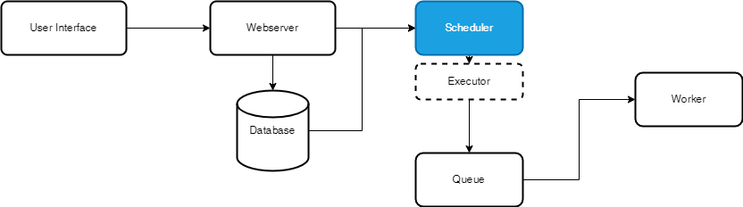

# dre-test

### 📑 Descrição do Projeto
O projeto dre-test tem como objetivo provisionar em ambiente docker a ferramenta Apache Airflow

```
### 🌎 Mapa do Projeto
Abaixo segue a estrutura de pastas e suas definições:

├───dags - Pasta referente aos scripts dags
│   └───**smooth.py** - Script dag
│       
├───compose.yml - Arquivo docker com ambiente Apache Airflow
├───.env - Arquivo de variaveis de ambiente 

```

### Passos para execução Windows

```PowerShell
# Cria estrutura de base de dados e redis
docker-compose up airflow-init

# Inicia todos os serviços
docker-compose up
```
### Arquitetura de Apache Airflow
```
Abaixo estará disponivel a arquitetura da ferramenta Apache Airflow e seus componentes instalados:

Arquitetura Apache Airflow:
    

 - Componentes Instalados do Apache Airflow:
    - **PostgreSQL**: Banco de dados que armazena o estado das DAGs, metadados, logs e informações de configuração, crucial para o funcionamento da ferramenta.
    - **Redis**: Armazena as mensagens e o estado de tarefas de forma eficiente. É usado como backend para a fila de tarefas.
    - **airflow-webserver**: Interface web que permite usuários visualizar e gerenciar DAGs
    - **airflow-scheduler**: Responsável por agendar e acionar a execução das tarefas das DAGs.
    - **airflow-worker**: Executa as tarefas agendadas pelo scheduler. Pode haver múltiplos workers para distribuição de carga.
    - **airflow-triggerer**: Executa tarefas disparado por fluxos ou eventos externos
    - **airflow-init**: Inicializa o banco de dados e configura seu schema.
    - **airflow-cli**: Interface de linha de comando para interagir com o Airflow, executar comandos e scripts.
    - **flower**:  Monitoramento em tempo real dos workers do Celery e das tarefas.
```
### Referência
```
https://airflow.apache.org/docs/apache-airflow/stable/howto/docker-compose/index.html
```